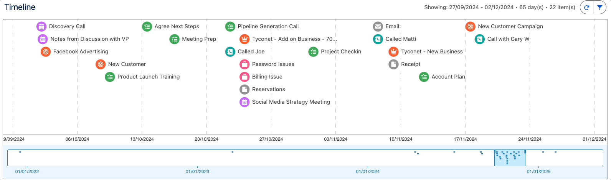

<h1 align="center">
	</br>
	Timeline<br>     
</h1>

<h4 align="center">
	<a href="#overview">Overview</a> |
	<a href="#installation-instructions">Install Me</a> |
	<a href="#how-it-works">How it Works</a> |
	<a href="#faqs">FAQs</a> |
	<a href="#contributing">Contribute</a>
</h4>
	
<h3 align="center">
	An interactive Lightning Web Component for the Salesforce platform<br><br>
	<a href="https://github.com/deejay-hub/timeline-lwc/network/members">
    		
  	</a>
  	<a href="https://github.com/deejay-hub/timeline-lwc/stargazers">
    		
  	</a>
  	<a href="https://github.com/deejay-hub/timeline-lwc/watchers">
    		
  	</a>
  	<a href="https://github.com/deejay-hub/timeline-lwc/issues">
    		
  	</a>
	<a href="https://www.codacy.com/manual/deejay-hub/timeline-lwc?utm_source=github.com&amp;utm_medium=referral&amp;utm_content=deejay-hub/timeline-lwc&amp;utm_campaign=Badge_Grade">
    		
  	</a>	
</h3>

<p align="center">
  
</p>

## Overview

A complete custom experience component. Created to allow users to view related records to a parent on an interactive timeline written with D3.js.

-   **Multi Object Support.** Plot related records to Lead, Account, Contact, Opportunity and Case.
-   **Junction Object Support.** Plot junction object records and use simple dot notation.
-   **Multi Language Support.** All labels and error messages as translatable custom labels.
-   **Locale Support for Dates.** Date formats change based on your Salesforce locale setting.
-   **3rd Party JS.** Demonstrates 3rd Party JS and Apex imperative callouts to populate data in an interactive timeline.
-   **Responsive interface.** Uses flexipageRegionWidth to determine where in the page it is located.
-   **Minimises server roundtrips.** Uses Lightning Data Service for tooltips and falls back to queried data when needed.

> This sample application is designed to run on Salesforce Platform. If you want to experience Lightning Web Components on any platform, please visit https://lwc.dev, and try out the Lightning Web Components sample application [LWC Recipes OSS](https://github.com/trailheadapps/lwc-recipes-oss).

## Installation Instructions

1. Set up your environment. Follow the steps in the [Quick Start: Lightning Web Components](https://trailhead.salesforce.com/content/learn/projects/quick-start-lightning-web-components/) Trailhead project. The steps include:

-   Enable Dev Hub in your Trailhead Playground
-   Install Salesforce CLI
-   Install Visual Studio Code
-   Install the Visual Studio Code Salesforce extensions, including the Lightning Web Components extension

2. If you haven't already done so, authenticate with your hub org and provide it with an alias (**myhuborg** in the command below):

```
sfdx force:auth:web:login -d -a myhuborg
```

3. Clone the timeline-lwc repository:

```
git clone https://github.com/deejay-hub/timeline-lwc
cd timeline-lwc
```

4. Create a scratch org and provide it with an alias (**timeline-lwc** in the command below):

```
sfdx force:org:create -s -f config/project-scratch-def.json -a timeline-lwc
```

5. Push the app to your scratch org:

```
sfdx force:source:push
```

6. Assign the Timeline_User permission set to the default user:

```
sfdx force:user:permset:assign -n Timeline_User
```

7. Load sample data:

```
sfdx force:data:tree:import --plan data/timeline-plan.json
```

8. Open the scratch org:

```
sfdx force:org:open
```

9. Navigate to **Sales**, under **App Launcher**, select the **Sales** app.

10. Find the contact **Jane Lo** and drill into her detailed information.

11. Navigate to **Setup**, and select Edit Page

12. Drag the timeline component into the page - found under custom components

<p align="center">
  
</p>

## How it Works

#### Object Support

Timeline is installed as a custom component available in the App Builder component pallette. Currently the component is available on the following record home pages:

-   Account
-   Contact
-   Lead
-   Opportunity
-   Case

This is a configuration limit specified in timeline.js-meta.xml. Since the timeline is designed to be driven from data it should be possible to extend the usage to other objects.

```
<targetConfig targets="lightning__RecordPage">
     <objects>
        <object>Contact</object>
        <object>Lead</object>
        <object>Account</object>
        <object>Case</object>
        <object>Opportunity</object>
     </objects>
</targetConfig>
```

#### Component Properties

The component has the following properties that can be set at design time in App Builder by an administrator

| Property                        | Description                      | Validation                             |
| ------------------------------- | -------------------------------- | -------------------------------------- |
| `Title`                         | Adjusts the label                | String                                 |
| `Height`                        | Adjusts the vertical height      | Picklist (1 - 5)                       |
| `Historical Time Range (Years)` | Adjusts the start date           | Picklist (0.25 - 5)                    |
| `Future Time Range (Years)`     | Adjusts the end date             | Picklist (0.25 - 1)                    |
| `Zoom Based On`                 | Adjusts the position of the zoom | Picklist (Current Date, Last Activity) |
| `Zoom Range (Days)`             | Adjusts the extent of the zoom   | Integer min 15 max 120                 |

#### Custom Labels

Labels can be translated where appropriate. Navigate to Setup -> Custom Labels and add translations for your chosen languages. Note you will need the permission - Manage Transalations.

| Label Name                           | Default translation                                                                            |
| ------------------------------------ | ---------------------------------------------------------------------------------------------- |
| `Timeline_Error_Apex`                | Apex error                                                                                     |
| `Timeline_Error_Setup`               | Setup error                                                                                    |
| `Timeline_Error_JavaScriptResources` | Unable to load JavaScript resources                                                            |
| `Timeline_Error_NoDataHeader`        | No data to display                                                                             |
| `Timeline_Error_NoDataSubHeader`     | Related records show up here on an interactive timeline. Check your filter or create a record. |
| `Timeline_Error_Unhandled`           | Houston...we've had a problem                                                                  |
| `Timeline_Label_Days`                | day(s)                                                                                         |
| `Timeline_Label_Items`               | item(s)                                                                                        |
| `Timeline_Label_Showing`             | Showing:                                                                                       |
| `Timeline_Label_Filters`             | Filters (Used in filter panel)                                                                 |
| `Timeline_Label_Filter_All_Types`    | All Types (Used in filter panel as select/deselect all checkbox)                               |
| `Timeline_Label_Filter_Type_Legend`  | Types to Show (Used in Filter panel)                                                           |
| `Timeline_Label_Files`               | Files & Notes (used in Filter when sObject is ContentDocumentLink)                             |
| `Timeline_Label_Date_Range_Legend`   | Date Range (Used in Filter panel)                                                              |
| `Timeline_Label_Apply`               | Label for apply button (Used in Filter panel)                                                  |
| `Timeline_Label_Cancel`              | Label for cancel button (Used in Filter panel)                                                 |

#### Configuring Child Records to Plot

Specifying which child records to plot is done using the **Timeline_Configuration_mdt** metadata type. When populating the metadata type the following is a description of the columns and their purpose

| Field Name                  | Description                                                                                                                                                                                      |
| --------------------------- | ------------------------------------------------------------------------------------------------------------------------------------------------------------------------------------------------ |
| `Parent_Object__c`          | The API Name of the **parent object** that the child record relates to                                                                                                                           |
| `Object_Name__c`            | The API Name of the object that is the **child** to plot                                                                                                                                         |
| `Relationship_Name__c`      | The API Name of the **relationship** between Parent and Child                                                                                                                                    |
| `Position_Date_Field__c`    | The API Name of the field on the child (Object_Name\_\_c) to use as the date value to use to position the record on the timeline (must be Date or Date/Time)                                     |
| `Detail_Field__c`           | The API Name of the field on the child (Object_Name\_\_c) to use as the description for the record to plot on the timeline                                                                       |
| `Icon__c`                   | A relative url to the image to use for this record                                                                                                                                               |
| `Icon_Background_Colour__c` | The background colour to use for the above image (rgb and hex supported)                                                                                                                         |
| `Type_Field__c`             | Reserved for 'Tasks' only. Used to specify the field to distinguish Calls vs Emails. Only used when Object_Name\_\_c is Task                                                                     |
| `Fallback_Tooltip_Field__c` | The API Name of the field on the child object to use when the UI API does not support this object. Timeline will use the Detail_Field**c value and the Fallback_Tooltip_Field**c as the tooltip. |
| `Allow_Drilldown__c`        | Should the object support drilling into the individual record. If false then a toast error will appear when a user clicks on that record type                                                    |
| `Drilldown_Id_Field__c`     | The field containing the Id value that should be used for the drilldown operation. e.g. Which record should the user be navigated to. Important for junction objects.                            |
| `Tooltip_Id_Field__c`       | The field containing the Id value that should be used for the hover tooltip e.g. Which record should the user see when they hover over a record on the timeline. Important for junction objects. |
| `Tooltip_Object_Name__c`    | The object used by the tooltip. The label is also looked up to use in the filter panel.                                                                                                          |
| `Test__c`                   | Protected records used for _Apex testing only_.                                                                                                                                                  |

## FAQs

#### How to I specify the fields for the tooltip?

For the most part the component uses the UI API powered by the Lightning Data Service (LDS). This means that the tooltip will use the compact layout of the object automatically in a 2 column format. So just update the compact layout for the object and it works like magic.
The bad news is that not all objects have support yet. For a list of supported objects see https://developer.salesforce.com/docs/atlas.en-us.uiapi.meta/uiapi/ui_api_get_started_supported_objects.htm. If you want to plot an object that isn't included in the list (e.g. Case Comments, Tasks etc) then the timeline can show 2 fields in the tooltip specified by the Detail_Field**c field value and the Fallback_Field**c field value. So fill these fields in only for those objects not supported by the UI API.

#### Does it support multiple languages other than English?

Yes - for left-to-right languages. The users locale setting in Salesforce determines the date formats used. For a list of supported locales see - https://help.salesforce.com/articleView?id=admin_supported_date_time_format.htm&type=5

All fields have their translated labels returned. Any custom labels can be translated (see Custom Labels).

Right-to-left languages can be supported but there are formatting issues currently that need to be fixed.

Please note that translated values are not currently included - you need to enable transalation workbench and add them yourself. If you would like to provide translated values for a language I would happily incorporate them for everyones benefit.

#### Does it support Communities?

Yes.

#### Does it support Mobile?

No. The timeline component is really best suited to the desktop. Long term it is a goal to come up with a mobile version suited to reduced real estate. At the moment the component cannot be dragged into a mobile layout.

#### Does it support Person Accounts?

No. The component will work on the Account page layout for Person Accounts but will not show Tasks that are related to the contact unless the What Id field is populated with the Person Account Id.

#### Does it support Files / Notes / Attachments?

Files and Notes (sometimes referred to as enhanced Notes) are supported. We have added any record in the ContentDocumentLink object.

#### Does it support External Objects / Big Objects?

No. Currently the SOQL is limited to those objects that can be included in a parent join. We would have to consider scale and performance too so for now the component only supports standard and custom objects.

#### Does it support History Objects?

No. History objects are deliberately removed from the query. They don't make good candidates to plot on the timeline due to the volume of updates typically seen.

#### Does it support Junction Objects?

Yes. We have tested support for Multiple Contacts to Tasks/Events || Multiple Contacts to Accounts and Contact Roles for Opportunities. We have also tested custom junction objects. We have added simple dot notation to be able to plot the fields from the destination object.

## Contributing

Contributions are what make the trailblazer community such an amazing place. I regard this component as a way to inspire and learn from others. Any contributions you make are **greatly appreciated**.

See [contributing.md](/contributing.md) for timeline principles.

## Utilities and Dependencies

#### Dependencies

-   D3.js v 5.7.0
-   moment.js v2.2.4

#### Code formatting

[Prettier](https://prettier.io/) is a code formatter used to ensure consistent formatting across your code base. To use Prettier with Visual Studio Code, install [this extension](https://marketplace.visualstudio.com/items?itemName=esbenp.prettier-vscode) from the Visual Studio Code Marketplace. The [.prettierignore](/.prettierignore) and [.prettierrc](/.prettierrc) files are provided as part of this repository to control the behavior of the Prettier formatter.

#### Code linting

[ESLint](https://eslint.org/) is a popular JavaScript linting tool used to identify stylistic errors and erroneous constructs. To use ESLint with Visual Studio Code, install [this extension](https://marketplace.visualstudio.com/items?itemName=salesforce.salesforcedx-vscode-lwc) from the Visual Studio Code Marketplace. The [.eslintignore](/.eslintignore) file is provided as part of this repository to exclude specific files from the linting process in the context of Lightning Web Components development.

#### Codacy

Codacy automates code reviews and monitors code quality over time. Static analysis, code coverage and metrics for JavaScript and Apex. Tests for common styling and security issues.
